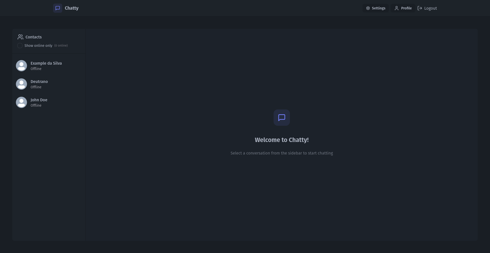
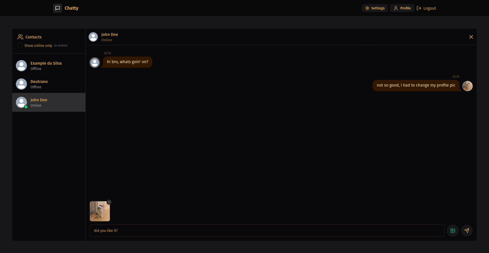
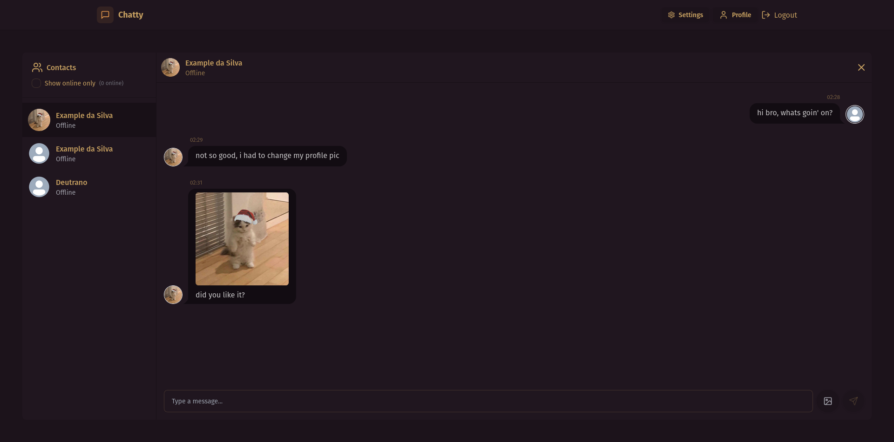
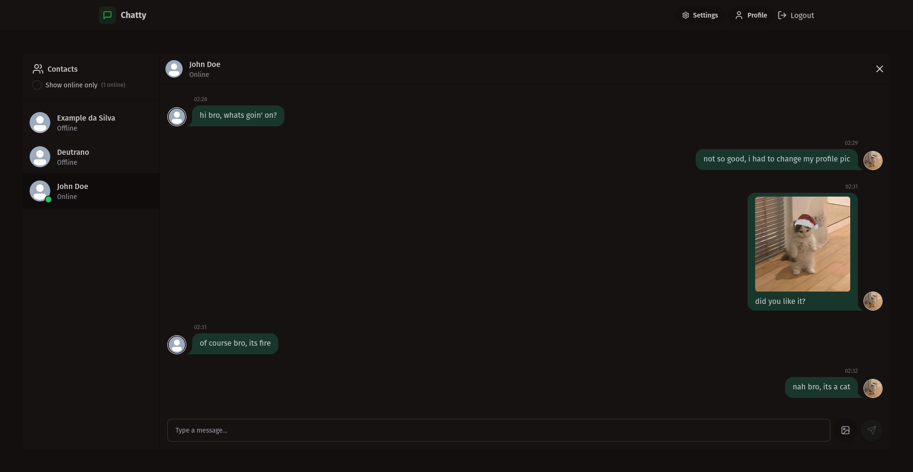
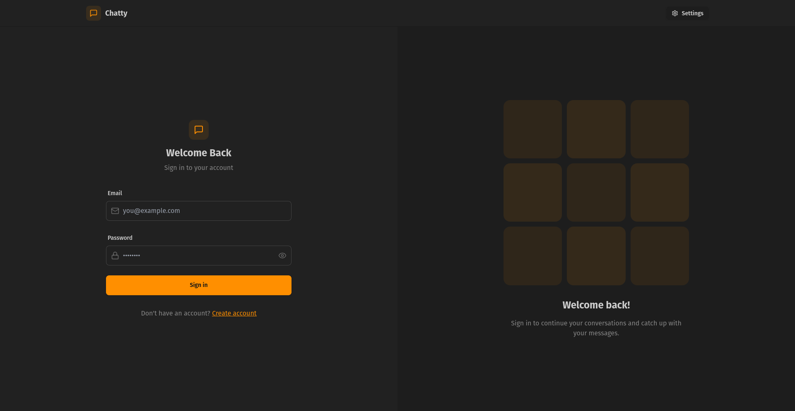
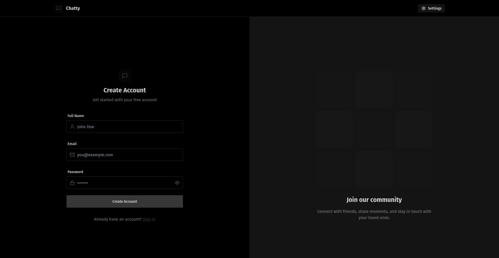
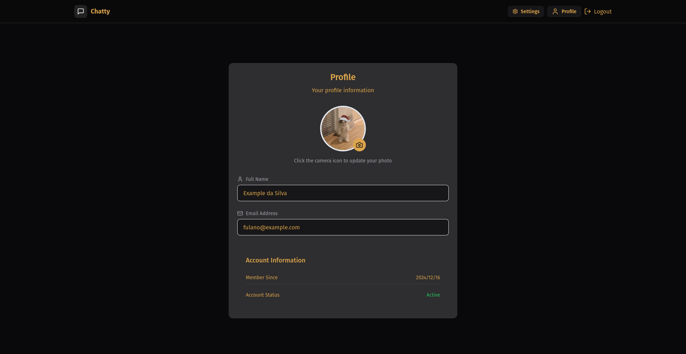
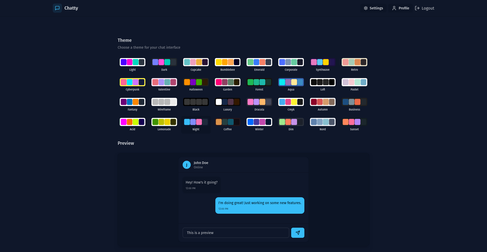

# Full-stack Chat App (Chatty)

### Made with:

- Front-end:
    - Vite
    - React
    - Lucid React
    - Hot Toaster
    - TypeScript
    - Zustand
    - TailwindCSS
    - DaisyUI
    - Axios

- Back-end:
    - Node
    - Express
    - Multer
    - Socket.io
    - Mongoose
    - MongoDB

### Gallery:

#### Home page:

#### Chat:

#### Login page:

#### Sign up page:

#### Profile page:

#### Settings page:

